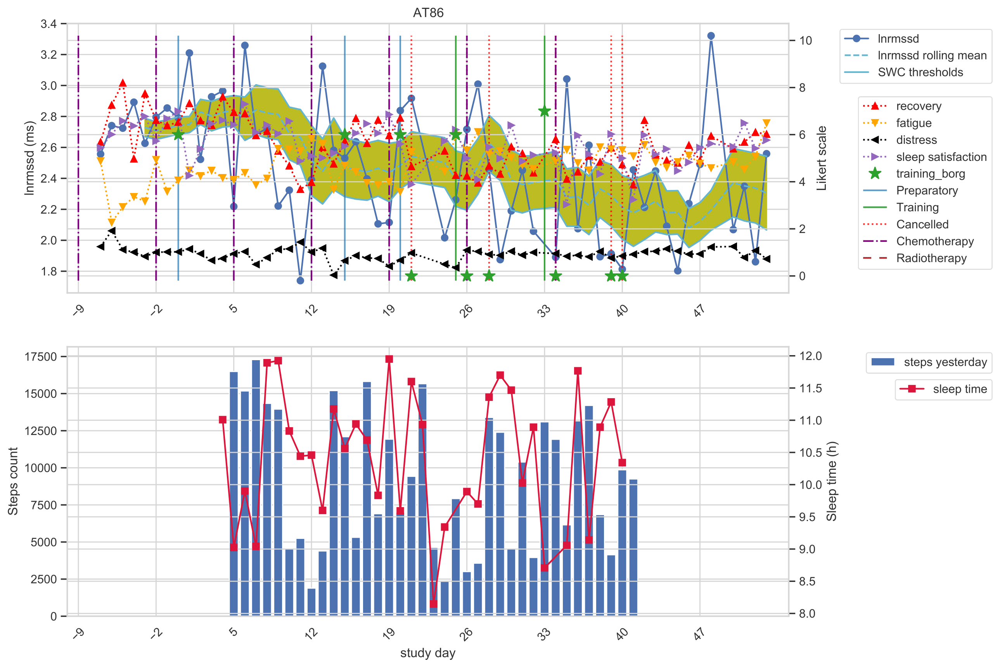

# ATOPE+Breast

Continuous Monitoring of Training Load in Patients with Breast Cancer during Therapeutic Exercise Intervention.

## Background
---

Multiple studies address therapeutic exercise interventions in patients with cancer [1, 2, 3, 4, 5]; however, these works typically measure the impact of the intervention by comparing health assessments (e.g., HRV) before and after the intervention.

The ATOPE+Breast dataset (ATOPE+ for patients with breast cancer) describes the daily status of 23 patients with breast cancer during therapeutic exercise intervention with daily measures of HRV, self-reported wellness, physical activity, and sleep. Besides, the ATOPE+Breast dataset contains information about training sessions, such as intensity recorded, demographic data, treatment details, initial evaluations of quality of life, physical activity levels, previous medical conditions, and risk factors. 

ATOPE+Breast was recorded using the ATOPE+ mHealth system, whose usability [6] and reliability [7] were successfully validated.

### References

- [1] Y.-H. Lee, G.-M. Lai, D.-C. Lee, L.-J. Tsai Lai, and Y.-P. Chang, “Promoting Physical and Psychological Rehabilitation Activities and Evaluating Potential Links Among Cancer-Related Fatigue, Fear of Recurrence, Quality of Life, and Physiological Indicators in Cancer Survivors,” Integr Cancer Ther, vol. 17, no. 4, pp. 1183–1194, Oct. 2018, doi: 10.1177/1534735418805149.
- [2] D. Niederer et al., “Exercise Effects on HRV in Cancer Patients,” International Journal of Sports Medicine, vol. 34, no. 01, pp. 68–73, Aug. 2012, doi: 10.1055/s-0032-1314816.
- [3] E. Caro-Moran, C. Fernandez-Lao, N. Galiano-Castillo, I. Cantarero-Villanueva, M. Arroyo-Morales, and L. Diaz-Rodriguez, “Heart Rate Variability in Breast Cancer Survivors After the First Year of Treatments: A Case-Controlled Study,” Biol. Res. Nurs., vol. 18, no. 1, pp. 43–49, Jan. 2016, doi: 10.1177/1099800414568100.
- [4] A. Dias Reis et al., “Effect of exercise training and detraining in autonomic modulation and cardiorespiratory fitness in breast cancer survivors,” J Sports Med Phys Fitness, vol. 57, no. 7–8, pp. 1062–1068, Aug. 2017, doi: 10.23736/S0022-4707.17.07012-8.
- [5] K. Schaffer et al., “Systematic Review of Randomized Controlled Trials of Exercise Interventions Using Digital Activity Trackers in Patients With Cancer,” Journal of the National Comprehensive Cancer Network, vol. 17, no. 1, pp. 57–63, Jan. 2019, doi: 10.6004/jnccn.2018.7082.
- [6] S. Moreno-Gutierrez et al., “ATOPE+: An mHealth System to Support Personalized Therapeutic Exercise Interventions in Patients With Cancer,” IEEE Access, vol. 9, pp. 16878–16898, 2021, doi: 10.1109/ACCESS.2021.3049398.
- [7] P. Postigo-Martin et al., “mHealth system (ATOPE+) to support exercise prescription in breast cancer survivors: A validity and reliability, cross-sectional observational study (ATOPE study) (Preprint),” JMIR mHealth and uHealth, Preprint, Jan. 2022. doi: 10.2196/preprints.36733.

## Description of Data Records
---
The data are stored in three distinct CSV files located at the `dataset` directory. Columns in each CSV file are delimited by semicolons.

### demographics.csv
---
The file `demographics.csv` stores data from initial screening, questionnaires of physical activity and quality of life, treatment details, previous medical conditions, and risk factors.

- **username** - Unique identifier for each participant.
- **age** - Age of each participant ranging 27 to 76 years.
- **sex** - Sex of each participant. Possible values are woman, man, and other.
- **ethnic_origin** - Ethnic origin of each participant. Possible values are caucasian and hispanic american. 
- **studies** - Level of studies of each participant. Possible values are basic, middle, and superior.
- **marital_status** - Civil status of each participant. Possible values are single, married, divorced, and widow.
- **employment_situation** - Emplyment situation of each participant. Possible values are unemployed, her duties, currently on leave, currently working, and retired.
- **n_family_unit** - Number of members in the family unit of each participant ranging 1 to 5.
- **income** - Income level of each participant. Possible values are \<500€, 500-1000€, 1000-1500€, 1500-2000€, and \>2000€.
- **smoking** - Indicates if the patients is a smoker (yes/no) or if she has been a smoker (ex-smoker).
- **alcohol** - Alcohol consumption habits of each participant. Possible values are daily, weekly, monthly, and no.
- **menopause** - Indicates if the patients is in premenopause or postmenopause stage.
- **dominant_side** - Dominant side for each participant (right or left).
- **operation_side** - Operation side for each participant (right, left, or both).
- **cancer_history_family** - Indicates if there was history of cancer in close family (yes/no).
- **breast** - Indicates if previous cancer in family was breast (yes/no).
- **colon** - Indicates if previous cancer in family was colon (yes/no).
- **prostate** - Indicates if previous cancer in family was prostate (yes/no). 
- **lung** - Indicates if previous cancer in family was lung (yes/no).
- **bladder** - Indicates if previous cancer in family was bladder (yes/no).
- **ovary** - Indicates if previous cancer in family was ovary (yes/no).
- **stomach** - Indicates if previous cancer in family was stomach (yes/no).
- **intestine** - Indicates if previous cancer in family was intestine (yes/no).
- **throat**  - Indicates if previous cancer in family was throat (yes/no).
- **thyroid**  - Indicates if previous cancer in family was thyroid (yes/no).
- **leukemia** - Indicates if previous cancer in family was leukemia (yes/no).
- **blood** - Indicates if previous cancer in family was blood (yes/no).
- **hypertension** - Indicates if patient was diagnosed with hyperthension (yes/no).
- **dyslipidemia** - Indicates if patient was diagnosed with dyslipidemia (yes/no).
- **diabetes** - Indicates if patient was diagnosed with diabetes (yes/no).
- **cardiovascular_disease** - Indicates if patient was diagnosed with cardiovascular disease (yes/no).
- **qlqc30_physical** - Physical activity score for QLQ-C30. Possible values range 0 to 100.
- **qlqc30_tasks** - Tasks score for QLQ-C30. Possible values range 0 to 100.
- **qlqc30_emotional** - Emotional score for QLQ-C30. Possible values range 0 to 100.
- **qlqc30_cognitive** - Cognitive score for QLQ-C30. Possible values range 0 to 100.
- **qlqc30_social** - Social score for QLQ-C30. Possible values range 0 to 100.
- **qlqc30_fatigue** - Fatigue score for QLQ-C30. Possible values range 0 to 100.
- **qlqc30_nausea** - Nausea score for QLQ-C30. Possible values range 0 to 100.
- **qlqc30_pain** - Pain score for QLQ-C30. Possible values range 0 to 100.
- **qlqc30_dyspnoea** - Dyspnoea activity score for QLQ-C30. Possible values range 0 to 100.
- **qlqc30_insomnia** - Insomnia score for QLQ-C30. Possible values range 0 to 100.
- **qlqc30_appetite** - Appetite score for QLQ-C30. Possible values range 0 to 100.
- **qlqc30_constipation** - Constipation score for QLQ-C30. Possible values range 0 to 100.
- **qlqc30_diarrhoea** - Diarrhoea score for QLQ-C30. Possible values range 0 to 100.
- **qlqc30_economic** - Economic score for QLQ-C30. Possible values range 0 to 100.
- **qlqc30_global_health** - Global health score for QLQ-C30. Possible values range 0 to 100.
- **ipaq_walking** - IPAQ score for walking activities, ranging 0 to 4158 METs.
- **ipaq_moderate** - IPAQ score for walking activities, ranging 0 to 1440 METs.
- **ipaq_vigorous** - IPAQ score for walking activities, ranging 0 to 1800 METs.
- **ipaq_sitting** - IPAQ score for walking activities, ranging 0 to 12 METs.
- **ipaq_total_met** - Total IPAQ score, ranging 0 to 4158 METs.
- **physical_activity_level** - Physical activity level derived from IPAQ. Possible values are low, moderate, and active.
- **height** - Height of each participant, ranging 152 to 177 cm.
- **weight** - Weight of each participant, ranging 51.9 to 89 kg.
- **bmi** - Body mass index of each participant, ranging 19.1 to 35.68 kg/m².
- **body_fat_mass** - Body fat mass of each participant, ranging 10.2 to 43 kg.
- **body_fat_percentage** - Body fat percentage of each participant, ranging 19.7 to 48.2%.
- **visceral_fat_area** - Visceral fat area of each participant, ranging 32.9 to 227.4 cm².
- **treatment** - Treatment undergoing each participant during therapeutic exercise intervention. Possible values are chemo, radio, and treatment-naive.

### records.csv
---
The file `records.csv` stores data from daily measurements of training load (HRV, self-reported wellness), Fitbit physical activity, Fitbit sleep, training details, and treatment events. All measures referring to the analysis of RR intervals are extracted from short-term HRV analysis. Fitbit sleep data may be categorized in classic or stages. Classic sleep data are retrieved from Fitbit API during the first days of monitoring; once Fitbit has enough sleep, it infers sleep stages, replacing
the classic categories.

- **username** - Unique identifier for each participant. 
- **study_day** - Study day since start of the therapeutic exercise intervention. Numbers may be negative if recordings started before the intervention.
- **session_type** - Type of session recorded. Possible values are preparatory_training, adjusted_training, miss_indisposed, chemo_red, chemo_white, radio_init, radio_finish, miss_pain, miss_other,  miss_nausea, miss_bad_sleep, and miss_fatigue.
- **session_number** - Number of training for each participant. Values range 1 to 23.
- **training_borg** - Post-exercise BORG for each training session. Possible values range 5 to 9.5, but also include 0 for missing appointments.
- **swc_lnrmssd_ok** - Indicates if today's LnRMSSD is inside (True) or outside (False) of the SWC thresholds defined for LnRMSSD (SWC = LnRMSSD_rolling_mean_7_days $\pm$ 0.5*LnRMSSD_rolling_std_7_days).
- **cv_lnrmssd_ok** - Indicates if CV of the LnRMSSD is below 4.5\%.
- **lnrmssd** - Logarithm of the root mean square of the successive differences for RR intervals.
- **lnrmssd_ref_mean** - Mean of the LnRMSSD for the previous 7 days (containing at least 5 measures).
- **lnrmssd_ref_std** - Standard deviation of the LnRMSSD for the previous 7 days (containing at least 5 measures).
- **swc_lnrmssd** - Normalized smallest worthwhile change of the LnRMSSD for the previous 7 days: *swc\_lnrmssd = (lnrmssd - lnrmssd\_ref\_mean) / lnrmssd\_ref\_std*. This continuous version of the SWC is used to enable rich exploration of the variations of the LnRMSSD.
- **cv_lnrmssd** - Coefficient of variation of the LnRMSSD for the previous 7 days: *cv_lnrmssd = lnrmssd\_ref\_std / lnrmssd\_ref\_mean*. 
- **sdnn** - Standard deviation of the RR intervals. 
- **sdsd** - Standard deviation of differences between adjacent RR intervals.
- **cvnni** - Coefficient of variation equal to the ratio of sdnn divided by mean_nni.
- **cvsd** - Coefficient of variation of successive differences (rmssd divided by mean_nni).
- **hf** - Variance in R-R intervals in the high frequency (0.15 to 0.40 Hz).
- **hfnu** - Normalized HF power.
- **lf** - Variance in R-R intervals in the low frequency (0.04 to 0.15 Hz).
- **lf_hf_ratio** - LF/HF ratio.
- **lfnu** -  Normalized LF power.
- **max_hr** - Maximum HR.
- **mean_hr** - Mean HR.
- **mean_nni** - Mean of the RR intervals.
- **median_nni** - Median of the RR intervals.
- **min_hr** - Minimum HR.
- **nni_20** - Number of differences in successive RR intervals greater than 20 ms.
- **nni_50** - Number of differences in successive RR intervals greater than 50 ms.
- **pnni_20** - Proportion of nni_20 divided by the total number of RR intervals.
- **pnni_50** - Proportion of nni_50 divided by the total number of RR intervals.
- **range_nni** - Difference between maximum and minimum RR intervals.
- **ratio_sd2_sd1** - Ratio between sd2 and sd1.
- **sd1** - Standard deviation of Poincare plot projection on the perpendicular to the line of identity.
- **sd2** - Standard deviation of Poincare plot projection on the line of identity.
- **std_hr** - Standard deviation of the HR.
- **total_power** - Total power density spectral.
- **vlf** - Variance in RR intervals in the very low frequency (0.003 to 0.04 Hz).
- **sleep_satisfaction** - Self-reported sleep satisfaction in continuous Likert scale (0.0 – 10.0).
- **sleep_time** - Self-reported sleep time (minutes).
- **distress** - Self-reported distress in continuous Likert scale (0.0 – 10.0).
- **recovery** - Self-reported recovery in continuous Likert scale (0.0 – 10.0).
- **fatigue** - Self-reported farigue in continuous Likert scale (0.0 – 10.0).
- **sleep_asleep** - Asleep sleep time (classic).
- **sleep_awake** - Awake sleep time (classic).
- **sleep_restless** - Restless sleep time (classic).
- **sleep_deep** - Deep sleep time (stages).
- **sleep_light** - Light sleep time (stages).
- **sleep_rem** - REM sleep time (stages).
- **sleep_unknown** - Unknown sleep time (stages).
- **sleep_wake** - Wake sleep time (stages).
- **sleep_total** - Total sleep time.
- **steps_sedentary** - Sedentary steps.
- **steps_light** - Light-intensity steps.
- **steps_moderate** - Moderate-intensity steps.
- **steps_vigorous** - Vigorous-intensity steps.
- **steps_total** - Total steps.
- **steps_sedentary_yesterday** - Sedentary steps for the previous day.
- **steps_light_yesterday** - Light-intensity steps for the previous day.
- **steps_moderate_yesterday** - Moderate-intensity steps for the previous day.
- **steps_vigorous_yesterday** - Vigorous-intensity steps for the previous day.
- **steps_total_yesterday** - Total steps for the previous day.

### fitbit_activity.csv
---
Detailed physical activity Fitbit data were stored in `fitbit_activity.csv`, including the steps, mets, calories and time in each intensity level of physical activity detected.

- **username** - Unique identifier for each participant. 
- **study_day** - Study day since start of the therapeutic exercise intervention. Numbers may be negative if recordings started before the intervention.
- **intensity** - Level of physical activity intensity recorded by Fitbit. Possible values are sedentary, light, moderate, vigorous, and total (sum of sedentary, light, moderate, and vigorous).
- **steps** - Number of steps recorded for each participant each study day.
- **mets** - Number of METS recorded for each participant each study day.
- **calories** - Number of calories recorded for each participant each study day.
- **activity_time** - Amount of time recorded in each type of physical activity intensity for each participant each study day.

## Visualization example
---

The following figure presents a visualization example patient AT86, it uses a factor of 0.5 to determine the threshold for categorical SWC (SWC = lnrmssd_ref_mean $\pm$ 0.5*lnrmssd_ref_std).

## Usage Notes
---

Zenodo reference.
